# Scribble Markdown Demo
Welcome to **Scribble**, a lightweight Markdown playground built for clarity, precision, and flow. It’s where syntax meets expression - from code blocks to equations, everything renders beautifully.

Built with care by [Leon](https://github.com/yushasama)

---

# Scribble Architecture Diagram (Built with Mermaid)
Here's how our magic is being done under the hood!

```mermaid
%%{init:{
  "theme":"base",
  "securityLevel":"loose",
  "layout":"elk",
  "flowchart":{"htmlLabels":true,"curve":"basis","nodeSpacing":28,"rankSpacing":32,"padding":8,"diagramPadding":8,"titleTopMargin":24},
  "themeVariables":{
    "background":"transparent",
      "primaryColor":"#0f172a",
    "primaryTextColor":"#e5e7eb",
    "primaryBorderColor":"#374151",
    "lineColor":"#8ab4f8",
    "clusterBkg":"#0b1220",
    "clusterBorder":"#374151",
    "edgeLabelBackground":"transparent"
  },
  "themeCSS": ".edgeLabel,.edgeLabel rect{fill:transparent!important;stroke:none!important;opacity:0!important}.flowchartTitleText{white-space:nowrap}.label foreignObject span{display:inline-block;white-space:normal;overflow-wrap:break-word;word-break:normal;hyphens:auto;line-height:1.25;min-width:12ch;max-width:34ch;text-align:center}"
}}%%

graph LR
  subgraph "Editor Layer"
    A[CodeMirror 6<br/>Editor]-->B[onChange Events<br/>Debounced]-->C[useSourceMapSync<br/>Bidirectional Sync]
  end
  subgraph "Processing Pipeline"
    D[ReactMarkdown<br/>Component]-->E[remarkGfm<br/>GitHub Flavored]-->F[remarkMath<br/>Math Processing]-->G[remarkSourceMap<br/>Line Mapping]
  end
  subgraph "Content Renderers"
    H[rehypeMathjax<br/>Math Rendering]
    I[Mermaid CDN<br/>Diagram Rendering]
    J[ShikiCode<br/>Syntax Highlighting]
  end
  subgraph "React Integration"
    K[ReactMarkdown<br/>Virtual DOM]-->L[useMemo<br/>Performance]-->M[Preview Pane<br/>Live Rendering]
  end
  subgraph "Worker Threads"
    N[Shiki Worker<br/>Syntax Highlighting]
  end
  subgraph "Theme System"
    O[Theme CSS<br/>Dynamic Variables]
    P[30+ Shiki Themes<br/>Code Highlighting]
  end

  C-->D
  G-->H
  G-->I
  G-->J
  H-->K
  I-->K
  J-->K
  N-->J
  O-->A
  O-->M
  P-->N

  classDef editorLayer fill:#1f2937,stroke:#374151,stroke-width:2px,color:#e5e7eb
  classDef processLayer fill:#111827,stroke:#374151,stroke-width:2px,color:#e5e7eb
  classDef renderLayer fill:#0b1220,stroke:#374151,stroke-width:2px,color:#e5e7eb
  classDef reactLayer fill:#1f2937,stroke:#374151,stroke-width:2px,color:#e5e7eb
  classDef workerLayer fill:#111827,stroke:#374151,stroke-width:2px,color:#e5e7eb
  classDef themeLayer fill:#0b1220,stroke:#374151,stroke-width:2px,color:#e5e7eb
  class A,B,C editorLayer
  class D,E,F,G processLayer
  class H,I,J renderLayer
  class K,L,M reactLayer
  class N workerLayer
  class O,P themeLayer
```


## 1. Text Formatting & Quotes
This document demonstrates **bold**, *italic*, `inline code`, and blockquotes.

> “Mathematics is not about numbers, equations, or algorithms: it’s about understanding.” - William Paul Thurston

---

## 2. Inline Math Example
The **Black–Scholes Equation** for a European call option is given by: $ C = S_0 N(d_1) - Ke^{-rT}N(d_2) $ where $ d_1 = \frac{\ln(S_0/K) + (r + \sigma^2/2)T}{\sigma \sqrt{T}} $, $ d_2 = d_1 - \sigma \sqrt{T} $.

---

## 3. Display Math

A down-and-out barrier call option can be expressed as: $ C_{DO} = S_0 e^{-qT} \Phi(\eta d_1) - K e^{-rT} \Phi(\eta d_2) - S_0 e^{-qT} \left(\frac{B^2}{S_0 K}\right)^{2\lambda} \Phi(\eta d_3) + K e^{-rT} \left(\frac{B^2}{S_0 K}\right)^{2\lambda - 2} \Phi(\eta d_4) $

where $ \lambda = \frac{r - q + \sigma^2/2}{\sigma^2} $, and $ \Phi $ is the CDF of the standard normal distribution.

---

## 4. More Display Math

Let’s take a look at how ChatGPT transforms your messages into meaningful responses, all through matrix computations. 

$$
\underbrace{
\begin{bmatrix}
u_{t+1}\\[3pt]
c_{t+1}\\[3pt]
m_{t+1}
\end{bmatrix}
}_{\mathbf{x}_{t+1}}
=
\underbrace{
\begin{bmatrix}
A_{uu} & A_{uc} & A_{um}\\[3pt]
A_{cu} & A_{cc} & A_{cm}\\[3pt]
A_{mu} & A_{mc} & A_{mm}
\end{bmatrix}
}_{A}
\mathbf{x}_t
+
\underbrace{
\begin{bmatrix}
B_u\\[3pt]
B_c\\[3pt]
B_m
\end{bmatrix}
}_{B} u_{t+1}
+
\underbrace{
\begin{bmatrix}
D_u\\[3pt]
D_c\\[3pt]
D_m
\end{bmatrix}
}_{D} \mathbf{p}
$$

The output distribution is generated as  

$$
\hat{\mathbf{y}}_{t+1} =
\underbrace{
\begin{bmatrix}
C_u & C_c & C_m
\end{bmatrix}
}_{C}
\mathbf{x}_{t+1},
\qquad
p(\text{token}_i)=
\dfrac{e^{(C_i\mathbf{x}_{t+1})}}
{\sum_j e^{(C_j\mathbf{x}_{t+1})}}.
$$

Here:
- $ A,B,C $ - fixed learned parameters.  
- $ \mathbf{x}_t $ - evolving conversation context.  
- $ \mathbf{p} $- persistent **personal embedding** that biases tone, phrasing, and preference.

This formulation illustrates how ChatGPT can maintain consistent personality and adapt its replies dynamically within the same session.

---

## 5. Code Example (C++)

```cpp
#include <iostream>
#include <vector>
using namespace std;

using ll = long long;
const ll MOD = 1'000'000'007LL;

struct Matrix {
    int n;
    ll mod;
    vector<vector<ll>> a;
    Matrix(int n, ll mod, bool ident = false) : n(n), mod(mod), a(n, vector<ll>(n, 0)) {
        if (ident) for (int i = 0; i < n; ++i) a[i][i] = 1;
    }
    Matrix operator*(const Matrix& o) const {
        Matrix r(n, mod);
        for (int i = 0; i < n; ++i) {
            for (int k = 0; k < n; ++k) if (a[i][k]) {
                ll aik = a[i][k];
                for (int j = 0; j < n; ++j) {
                    r.a[i][j] = (r.a[i][j] + aik * o.a[k][j]) % mod;
                }
            }
        }
        return r;
    }
};

Matrix mpow(Matrix base, long long p) {
    Matrix ans(base.n, base.mod, true);
    while (p > 0) {
        if (p & 1LL) ans = ans * base;
        base = base * base;
        p >>= 1;
    }
    return ans;
}

int main() {
    ios::sync_with_stdio(false);
    cin.tie(nullptr);

    int n, m; long long k;
    cin >> n >> m >> k;

    Matrix A(n, MOD); // A[from][to]
    for (int i = 0; i < m; ++i) {
        int from, to; // edge from -> to, 1-indexed input
        cin >> from >> to;
        --from; --to;
        A.a[from][to] = (A.a[from][to] + 1) % MOD; // row=from, col=to
    }

    Matrix Ak = mpow(A, k);

    // dp[0] = e1^T picks the first row when multiplying on the left:
    // dp[k][n] = (e1^T * A^k)[n] = (A^k)[0][n-1]
    cout << Ak.a[0][n-1] << "\n";
    return 0;
}

```

This is a classic matrix exponentiation problem - [CSES - Grid Paths 1](https://cses.fi/problemset/task/1638/). We count the number of paths of length `k` in a grid using adjacency matrix exponentiation.

---

## 6. Lists & Tables

### Unordered List
- Black–Scholes Model  
- Barrier Options  
- Linear Algebra Decompositions  

### Table Example
| Concept | Symbol | Description |
|----------|---------|-------------|
| Volatility | $ \sigma $ | Standard deviation of returns |
| Discount rate | $ r $ | Risk-free rate |
| Payoff | $ \max(S_T - K, 0) $ | Call option payoff |

---

## 7. Links & References

Check out:  
- [Codeforces](https://codeforces.com)
- [Mermaid Charts](https://www.mermaidchart.com/)
- [Black–Scholes on Wikipedia](https://en.wikipedia.org/wiki/Black%E2%80%93Scholes_model)  
- [KaTeX Documentation](https://katex.org/docs/supported.html)

---

## 8. Images
Gold Ship is a legendary Japanese racehorse born in 2009, famous for his mix of incredible talent and chaotic personality.

He won major races such as the **Satsuki Sho**, **Kikuka Sho**, and **Arima Kinen**, and became the first horse to win the **Takarazuka Kinen** twice.

Fans adored him for his wild and unpredictable antics, like refusing to start or suddenly sprinting off mid-race.

After retirement, he settled in **Hokkaido** as a popular breeding stallion, loved as much for his spirit as his skill.


---

## 9. Footnotes
Here’s an example of a footnote.[^1]

[^1]: This document demonstrates Markdown + Math + Code rendering for editor testing.
