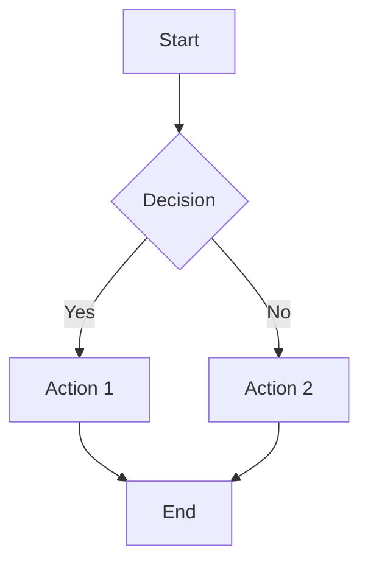
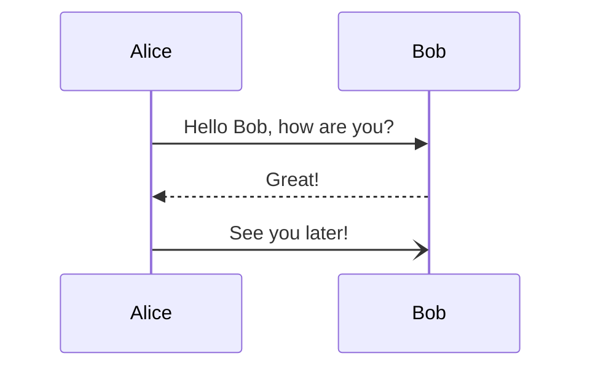

# Scribble 🧠

A clean, fast, offline-capable Markdown editor with KaTeX, syntax highlighting, and beautiful themes.

## Features

- **Real-time preview** with syntax highlighting
- **Math support** with KaTeX: $E = mc^2$ and $$\int_{-\infty}^{\infty} e^{-x^2} dx = \sqrt{\pi}$$
- **Code highlighting** with Prism.js
- **Mermaid diagrams** support
- **Multiple themes** including Tokyo Night, Nord, Solarized Dark, GitHub Light/Dark, Witchhazel, and Doki
- **Export options** (PDF, HTML, Markdown, JSON)
- **Local storage** auto-save
- **Responsive design** with split-pane layout

## Getting Started

### Prerequisites

- Node.js 18+ 
- npm or yarn

### Installation

1. Clone the repository:
```bash
git clone <repository-url>
cd scribble
```

2. Install dependencies:
```bash
npm install
```

3. Start the development server:
```bash
npm run dev
```

4. Open your browser and navigate to `http://localhost:5173`

## Usage

### Basic Editing

- Start typing in the editor on the left
- See real-time preview on the right
- Use Markdown syntax for formatting

### Math Mode

Scribble supports both inline and display math using KaTeX:

**Inline Math:**
```markdown
The famous equation is $E = mc^2$ and the derivative is $\frac{d}{dx}x^2 = 2x$.
```

**Display Math:**
```markdown
$$
\int_{-\infty}^{\infty} e^{-x^2} dx = \sqrt{\pi}
$$

$$
\begin{align}
\nabla \times \vec{\mathbf{B}} -\, \frac1c\, \frac{\partial\vec{\mathbf{E}}}{\partial t} &= \frac{4\pi}{c}\vec{\mathbf{j}} \\
\nabla \cdot \vec{\mathbf{E}} &= 4 \pi \rho \\
\nabla \times \vec{\mathbf{E}}\, +\, \frac1c\, \frac{\partial\vec{\mathbf{B}}}{\partial t} &= \vec{\mathbf{0}} \\
\nabla \cdot \vec{\mathbf{B}} &= 0
\end{align}
$$
```

**Math Examples:**
- Black-Scholes formula: $C = S_0 N(d_1) - Ke^{-rT}N(d_2)$
- Matrix notation: $\begin{pmatrix} a & b \\ c & d \end{pmatrix}$
- Summation: $\sum_{i=1}^{n} x_i = x_1 + x_2 + \cdots + x_n$

### Mermaid Diagrams

Create flowcharts, sequence diagrams, and more:





### Math Support

Inline math: `$E = mc^2$`

Block math:
```
$$
\int_{-\infty}^{\infty} e^{-x^2} dx = \sqrt{\pi}
$$
```

### Code Highlighting

Use fenced code blocks with language specification:

\`\`\`typescript
interface Theme {
  name: string;
  background: string;
  text: string;
}
\`\`\`

### Mermaid Diagrams

\`\`\`mermaid
graph TD
    A[Start] --> B{Decision}
    B -->|Yes| C[Action 1]
    B -->|No| D[Action 2]
\`\`\`

### Themes

Switch between 7 built-in themes:
- Tokyo Night
- Nord  
- Solarized Dark
- GitHub Dark
- GitHub Light
- Witchhazel
- Doki

### Export Options

- **Markdown**: Export raw markdown file
- **HTML**: Export styled HTML with embedded CSS
- **PDF**: Export to PDF with current theme
- **JSON**: Export complete session data for backup/import

### Import

Import previously exported JSON files to restore your session with theme and settings.

## Architecture

```
/src
 ├─ components/
 │   ├─ Editor.tsx           ← CodeMirror input
 │   ├─ Preview.tsx          ← Renderer with themes
 │   ├─ Toolbar.tsx          ← Export / Import / Save
 │   └─ ThemePicker.tsx      ← Theme selection
 ├─ renderer/
 │   └─ pipeline.ts          ← WASM → AST → React DOM
 ├─ utils/
 │   ├─ export.ts            ← PDF / HTML / MD / JSON
 │   ├─ import.ts            ← JSON → state restore
 │   └─ debounce.ts          ← Debounced updates
 ├─ themes/
 │   └─ index.ts             ← Theme definitions
 └─ workers/
     └─ parser.worker.ts     ← WASM parser bridge
```

## Technology Stack

- **React 18** + **TypeScript**
- **Vite** for fast development
- **CodeMirror 6** for editing
- **React Markdown** for rendering
- **KaTeX** for math rendering
- **Prism.js** for syntax highlighting
- **Mermaid.js** for diagrams
- **html2pdf.js** for PDF export

## Performance

- Debounced updates (200ms) for smooth editing
- Lazy loading of external libraries
- Local storage auto-save
- Optimized re-renders with React hooks

## Browser Support

- Chrome 90+
- Firefox 88+
- Safari 14+
- Edge 90+

## Contributing

1. Fork the repository
2. Create a feature branch
3. Make your changes
4. Add tests if applicable
5. Submit a pull request

## License

MIT License - see LICENSE file for details.

## Acknowledgments

- [CodeMirror](https://codemirror.net/) for the excellent editor
- [React Markdown](https://github.com/remarkjs/react-markdown) for markdown rendering
- [KaTeX](https://katex.org/) for math rendering
- [Mermaid](https://mermaid-js.github.io/) for diagram support
- Theme inspirations from popular code editors and terminals