# Scribble Architecture Diagram

```mermaid
%%{init: {
  'theme': 'base',
  'themeVariables': {
    'primaryColor': '#007acc',
    'primaryTextColor': '#d4d4d4',
    'primaryBorderColor': '#3e3e42',
    'lineColor': '#007acc',
    'secondaryColor': '#2d2d30',
    'tertiaryColor': '#1e1e1e'
  }
}}%%

graph TB
    subgraph "User Interface Layer"
        UI[Browser UI]
        Editor[CodeMirror Editor]
        Preview[React Markdown Preview]
        ThemePicker[Theme Picker]
        Export[Export Controls]
    end

    subgraph "Application Core"
        App[App.tsx<br/>Main Application State]
        State[State Management<br/>• Content<br/>• Theme<br/>• Settings]
        LocalStorage[Local Storage<br/>Auto-save & Persistence]
    end

    subgraph "Components Layer"
        EditorComponent[Editor Component<br/>• CodeMirror 6<br/>• Markdown Syntax<br/>• Live Editing]
        PreviewComponent[Preview Component<br/>• React Markdown<br/>• Real-time Rendering]
        ShikiComponent[Shiki Code Component<br/>• Syntax Highlighting<br/>• Worker-based]
    end

    subgraph "Rendering Pipeline"
        Pipeline[Renderer Pipeline<br/>• Markdown Processing<br/>• AST Generation]
        MathEngine[Math Rendering<br/>• KaTeX Integration<br/>• MathJax Support]
        MermaidEngine[Mermaid Diagrams<br/>• Flowcharts<br/>• Sequence Diagrams]
    end

    subgraph "Worker Threads"
        ParserWorker[Parser Worker<br/>• WASM Bridge<br/>• Markdown Parsing]
        ShikiWorker[Shiki Worker<br/>• Syntax Highlighting<br/>• Theme Processing]
    end

    subgraph "Export System"
        PDFExport[PDF Export<br/>• html2canvas<br/>• pdf-lib]
        HTMLExport[HTML Export<br/>• Inline Styles<br/>• Theme Embedding]
        MarkdownExport[Markdown Export<br/>• Raw Content<br/>• Metadata]
        JSONExport[JSON Export<br/>• Session Backup<br/>• Settings]
    end

    subgraph "Theme System"
        ThemeDefinitions[Theme Definitions<br/>• 8 Built-in Themes<br/>• Custom Properties]
        CodeThemes[Code Themes<br/>• 30+ Shiki Themes<br/>• VS Code Quality]
        ThemeCSS[Theme CSS<br/>• Dynamic Generation<br/>• CSS Variables]
    end

    subgraph "External Dependencies"
        Vite[Vite Build System<br/>• Development Server<br/>• HMR]
        React[React 18<br/>• Component Library<br/>• Hooks]
        CodeMirror[CodeMirror 6<br/>• Editor Engine<br/>• Extensions]
        ReactMarkdown[React Markdown<br/>• Markdown Renderer<br/>• Plugin System]
    end

    %% User interactions
    UI --> App
    Editor --> EditorComponent
    Preview --> PreviewComponent
    ThemePicker --> ThemeDefinitions
    Export --> PDFExport
    Export --> HTMLExport
    Export --> MarkdownExport
    Export --> JSONExport

    %% Application flow
    App --> State
    State --> LocalStorage
    App --> EditorComponent
    App --> PreviewComponent
    App --> ThemePicker

    %% Component relationships
    EditorComponent --> CodeMirror
    PreviewComponent --> ReactMarkdown
    PreviewComponent --> MathEngine
    PreviewComponent --> MermaidEngine
    PreviewComponent --> ShikiComponent

    %% Rendering pipeline
    Pipeline --> ParserWorker
    ShikiComponent --> ShikiWorker
    MathEngine --> MathJax
    MermaidEngine --> Mermaid

    %% Theme system
    ThemeDefinitions --> ThemeCSS
    CodeThemes --> ShikiWorker
    ThemeCSS --> EditorComponent
    ThemeCSS --> PreviewComponent

    %% Export relationships
    PDFExport --> html2canvas
    PDFExport --> pdf-lib
    HTMLExport --> ThemeCSS

    %% Build system
    Vite --> React
    Vite --> CodeMirror
    Vite --> ReactMarkdown

    %% Styling
    classDef uiLayer fill:#1e1e1e,stroke:#007acc,stroke-width:2px,color:#d4d4d4
    classDef appCore fill:#2d2d30,stroke:#007acc,stroke-width:2px,color:#d4d4d4
    classDef componentLayer fill:#3b4252,stroke:#88c0d0,stroke-width:2px,color:#d8dee9
    classDef workerLayer fill:#4c566a,stroke:#a3be8c,stroke-width:2px,color:#e5e9f0
    classDef exportLayer fill:#5e81ac,stroke:#d08770,stroke-width:2px,color:#eceff4
    classDef themeLayer fill:#81a1c1,stroke:#b48ead,stroke-width:2px,color:#e5e9f0
    classDef externalLayer fill:#88c0d0,stroke:#88c0d0,stroke-width:2px,color:#2e3440

    class UI,Editor,Preview,ThemePicker,Export uiLayer
    class App,State,LocalStorage appCore
    class EditorComponent,PreviewComponent,ShikiComponent,Pipeline,MathEngine,MermaidEngine componentLayer
    class ParserWorker,ShikiWorker workerLayer
    class PDFExport,HTMLExport,MarkdownExport,JSONExport exportLayer
    class ThemeDefinitions,CodeThemes,ThemeCSS themeLayer
    class Vite,React,CodeMirror,ReactMarkdown externalLayer
```

## Architecture Overview

Scribble is a sophisticated markdown editor built with modern web technologies. The architecture follows a layered approach with clear separation of concerns:

### Key Architectural Components:

1. **User Interface Layer**: Provides the browser-based interface with split-pane editing
2. **Application Core**: Manages state, persistence, and application lifecycle
3. **Components Layer**: React components handling editor, preview, and syntax highlighting
4. **Rendering Pipeline**: Processes markdown content through various engines
5. **Worker Threads**: Offloads heavy processing to web workers for performance
6. **Export System**: Handles multiple export formats (PDF, HTML, Markdown, JSON)
7. **Theme System**: Provides extensive theming capabilities with 8+ UI themes and 30+ code themes
8. **External Dependencies**: Core libraries including React, CodeMirror, and Vite

### Technology Stack:
- **Frontend**: React 18 + TypeScript
- **Build Tool**: Vite with HMR
- **Editor**: CodeMirror 6 with markdown support
- **Rendering**: React Markdown with KaTeX and Mermaid support
- **Syntax Highlighting**: Shiki (VS Code quality)
- **Export**: html2canvas + pdf-lib for PDF generation
- **Persistence**: LocalStorage for auto-save
- **Workers**: Web Workers for performance-critical operations

### Key Features:
- Real-time markdown preview
- Math equation rendering with KaTeX
- Mermaid diagram support
- Syntax highlighting with 30+ themes
- Multiple export formats
- Offline-capable with local storage
- Responsive split-pane layout